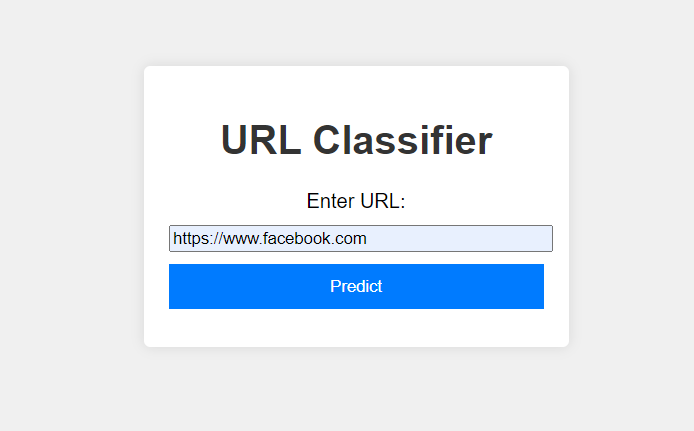

# Cyber-threat

## URL Classification using SVM

This repository contains code for training a Support Vector Machine (SVM) model to classify URLs into different types (e.g., malicious or benign). 

### Features:
- **Dataset**: Includes a collection of URLs with corresponding labels (types).
- **Feature Extraction**: Utilizes TF-IDF vectorization to transform URLs into numerical features.
- **Model Training**: Implements SVM with a linear kernel for classification.
- **Evaluation**: Measures model performance using accuracy metrics.

### Usage:
1. **Dataset Preparation**: Ensure your dataset (`urls.csv`) contains URLs and their respective types.
2. **Installation**: Install necessary dependencies (`scikit-learn`, `pandas`).
3. **Training**: Execute model to preprocess data, train the SVM model, and save the trained model.
4. **Prediction**: Use the saved model to classify new URLs using the trained model.

### Requirements:
- Python
- scikit-learn
- pandas
## Examples

### URL input page

### Predicted Output

